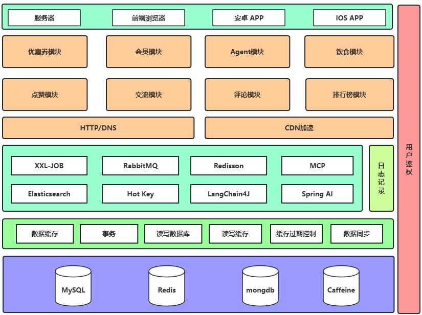

# 🦌 fawn-health-backend

## 📌 项目简介

“小鹿健康”是一个面向高校学生与年轻群体的全平台健康管理App，集 **健康数据记录**、**饮食管理**、**AI 分析推荐** 与 **社区互动** 于一体。 项目基于 Java 21 + Spring Boot 3 构建，配合大模型智能推荐、图像识别与健康知识图谱，致力于打造一个真正智能化、个性化的健康生活App。

平台主要功能包括：

- 🧍 **个体健康档案管理**：用户可便捷记录身高、体重、BMI、体脂率等关键指标，系统支持趋势图展示，帮助用户持续监控健康状态。
- 🍱 **饮食记录与营养分析**：支持上传每日三餐照片与文字描述，结合 AI 图像识别和自然语言处理实现营养估算与热量提醒。
- 🧠 **智能推荐与健康建议**：通过用户数据和大模型推理能力，为用户定制个性化饮食建议与作息改善计划。
- 💬 **社区互动与社群激励**：支持发布动态、评论互动、点赞打卡，构建正向激励的社群文化，鼓励用户在互动中坚持健康目标。

“小鹿健康”不仅是一个记录工具，更是一个激励人们改变生活方式、培养健康习惯的智慧健康伙伴。小鹿健康，让健康管理更简单 🦌💚。

## ✨ **技术选型**

- **Java 21 + Spring Boot 3 框架**：基础开发框架，提效增能。
- 🤖 **Spring AI + LangChain4j**：智能问答，精准回复。
- 🔍 **RAG 知识库**：上下文智能检索，知识速获。
- 💾 **Pinecone 向量数据库**：存健康图像、饮食向量。
- ⚙️ **Tool Calling 工具调用机制**：按需调工具，扩展功能。
- 🤝 **MCP 模型上下文协议**：多模型协同，强化功能。
- 🧑‍🤝‍🧑 **ReAct Agent 智能体构建**：构建智能体，给健康建议。
- 🔗 **百炼 AI 大模型平台**：接入大模型 API，赋能智能服务。
- 🌐 **Jsoup 网页抓取**：抓取健康知识，丰富知识库。
- 📄 **iText PDF 生成**：生健康报告，导出 PDF。
- 📘 **Knife4j 接口文档**：支持 Swagger/OpenAPI，助接口对接。
- 🐬 **MySQL**：存结构化健康、饮食数据。
- 🔍 **Redis**：缓存加速，提高排行榜及用户数据响应。
- 🧳 **Caffeine**：本地缓存，减数据库压力，快读取。
- 🔐 **JWT 鉴权机制**：JWT 鉴权，保系统安全。
- 🐇 **RabbitMQ**：消息队列，异步解耦，强扩展性。
- 🦌 **Elasticsearch**：分布式搜索，析健康及行为数据。
- 🔥 **Hot Key**：监热点 key，防瓶颈，保高并发。
- 🌍 **阿里云 OSS 对象存储**：存图、视频等对象数据。

## 🔧 系统架构

## 📦 安装教程

1. 克隆项目到本地：

   ```bash
   git clone https://gitee.com/xiao-shang-1/fawn-health-backend.git
   ```

1. 导入项目至 IDE（建议 IntelliJ IDEA）

2. 配置数据库连接与邮箱服务

3. 初始化数据库（执行 `/sql/create.sql`）

4. 启动项目：

   ```bash
   mvn spring-boot:run
   ```

## 🤝 参与贡献

我们欢迎你的贡献！请遵循以下流程参与开发：

1. Fork 本仓库
2. 新建特性分支：`git checkout -b feat_xxx`
3. 提交代码：`git commit -m "🚀 feat: 添加 xxx 功能"`
4. 推送到分支：`git push origin feat_xxx`
5. 提交 Pull Request

## 📝 提交规范

| 类型     | 含义             | 图标 |
| -------- | ---------------- | ---- |
| feat     | 新功能           | 🚀    |
| fix      | 修复 Bug         | 🐛    |
| docs     | 文档修改         | 📚    |
| style    | 格式优化         | 🎨    |
| refactor | 重构代码         | ♻️    |
| perf     | 性能优化         | ⚡️    |
| test     | 添加/修改测试    | 🧪    |
| chore    | 杂项、构建工具等 | 🔧    |
| build    | 构建相关变更     | 📦    |
| ci       | CI/CD 配置       | 🤖    |
| init     | 项目初始化       | 🧱    |

**提交示例：**

```bash
🚀 feat(user): 添加邮箱注册功能  
🐛 fix(login): 修复验证码校验问题  
📚 docs(readme): 完善项目说明文档  
```
🎉 **欢迎 Star 本项目，一起为健康生活助力！**